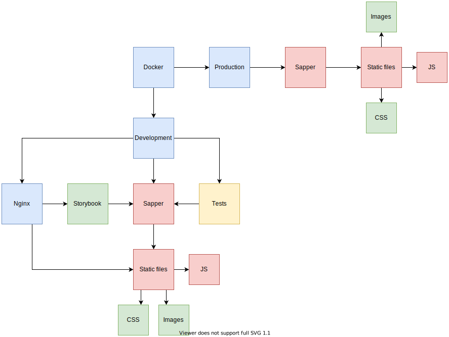

# SENT-template

[https://github.com/Zimtir/SENT-template](https://github.com/Zimtir/SENT-template)

## Sapper Express Node Template


[](https://github.com/prettier/prettier?style=for-the-badge)
[](https://github.com/eslint/eslint?style=for-the-badge)


## Design



## Usage

```shell
# for Rollup
npx degit "Zimtir/SENT-template" my-app
```

## Docs

[Wiki](https://github.com/Zimtir/SENT-template/wiki)

## List of features

- [Commitlint](https://github.com/conventional-changelog/commitlint)
- [Cypress](https://docs.cypress.io/guides/overview/why-cypress.html#In-a-nutshell)
- [Develop in container](https://code.visualstudio.com/docs/remote/containers)
- [Docker](https://www.docker.com/)
- [Docker Compose](https://docs.docker.com/compose/)
- [DotEnv](https://github.com/motdotla/dotenv)
- [EditorConfig](https://editorconfig.org/)
- [ESLint](https://eslint.org/)
- [Express.js](https://www.npmjs.com/package/express)
- [Fontello](http://fontello.com/)
- [GitHub Actions](https://docs.github.com/en/actions)
- [Helmet](https://helmetjs.github.io/)
- [Husky](https://github.com/typicode/husky)
- [Lint staged](https://github.com/okonet/lint-staged)
- [Nginx](https://nginx.org/)
- [Node.js](https://nodejs.org/en/)
- [Prettier](https://prettier.io/)
- [SASS](https://sass-lang.com/documentation)
- [Sapper.js](https://sapper.svelte.dev/)
- [Size Limit](https://github.com/ai/size-limit)
- [Storybook](https://storybook.js.org/)
- [Stylelint](https://github.com/stylelint/stylelint)
- [Svelte.js](https://svelte.dev/)
- [Typescript](https://www.typescriptlang.org/)
